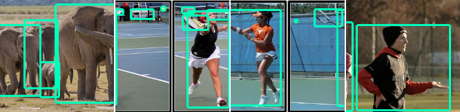
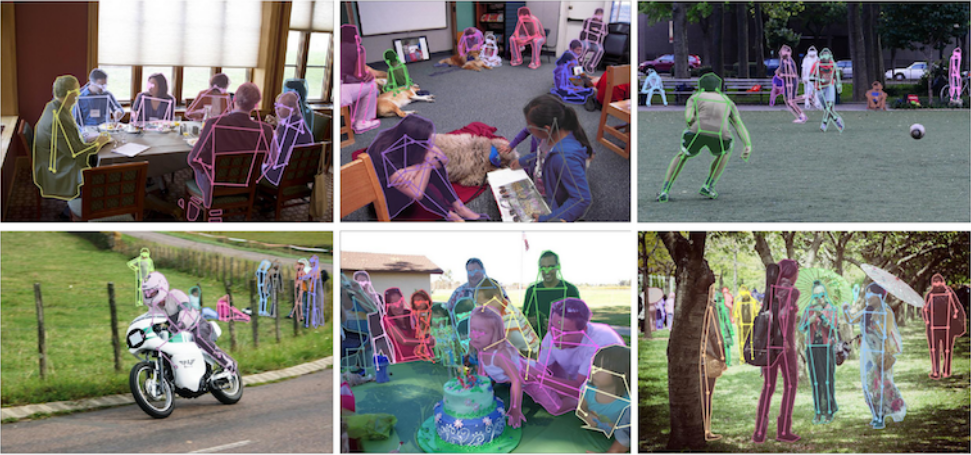
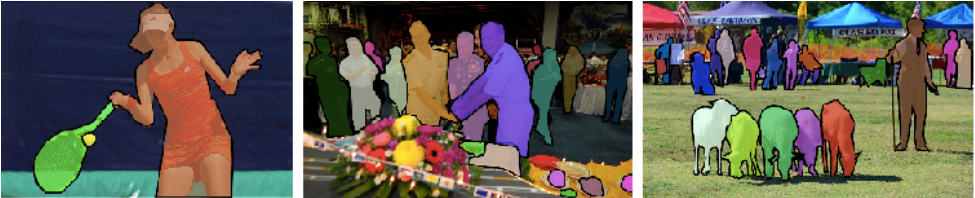
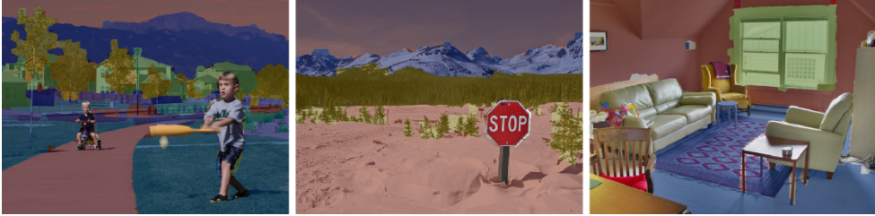
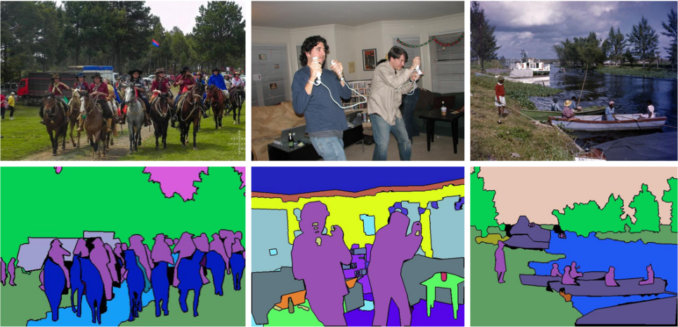

# End to End Computer Vision ML pipelines with MLflow Projects

Train your Computer Vision model easily on any custome dataset and track experement using MLflow project and tracking. You can choose official PyTorch models trained on COCO datasets, or choose any backbone from Torchvision classification models, or even write your own custome backbones.

**Object Detection (Bounding Box)**


**Keypoint Detection**


**Instance Segmentation**


**Stuff Segmentation**


**Panoptic Segmentation**



## Install
1. Install CUDA and cuDNN if you have not already done
    ```
     conda install pytorch torchvision torchaudio cudatoolkit=10.2 -c pytorch
    ```
    OR install the version with CUDA support as per your choice from **[here](https://pytorch.org/get-started/locally/)**.

2. Now install requirements file
    ```
    pip install -r requirements.txt
    ```

## Training on Custom Dataset

Here we are using *Coco dataset* run `download_coco.sh` script to download coco dataset under data directory. Update following `coco.yaml` under `data_configs` make sure that coco data is present in  `data` folder in below format before proceeding with further steps.

```
# Images and labels direcotry should be relative to train.py
TRAIN_DIR_IMAGES: '../../xml_od_data/coco2017/train2017'
TRAIN_DIR_LABELS: '../../xml_od_data/coco2017/train_xml'
VALID_DIR_IMAGES: '../../xml_od_data/coco2017/val2017'
VALID_DIR_LABELS: '../../xml_od_data/coco2017/val_xml'

.....

# Number of classes (object classes + 1 for background class in Faster RCNN).
NC: 81

# Whether to save the predictions of the validation set while training.
SAVE_VALID_PREDICTION_IMAGES: True
```

Next,to start the training, you can use the following command.

**Command format:**
```
python train.py --config <path to the data config YAML file> --epochs 100 --model <model name (defaults to fasterrcnn_resnet50)> --project-name <folder name inside output/training/> --batch-size 16
```
